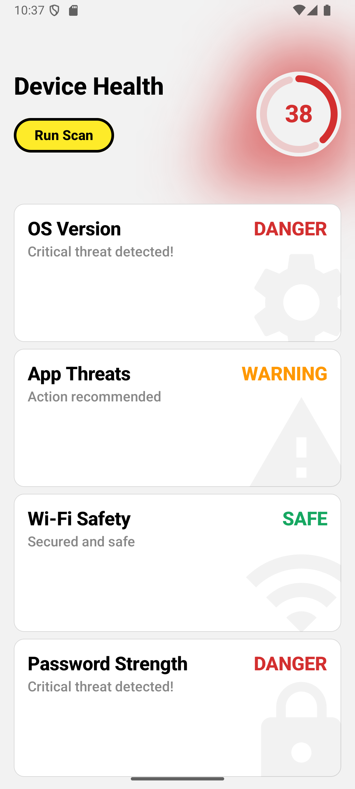

# Norton Security Dashboard

**[Demo on YouTube](https://youtu.be/TX_fHBru2Mk)**

## Project Overview

- **Chosen Option:** A

- **Description:** A native Android application serving as a device security dashboard. Built with
  Kotlin, Jetpack Compose, and a strict MVVM architecture. The project demonstrates reactive UI,
  dynamic state calculation, and modular UI components. Developed with an
  AI-first approach to accelerate prototyping and optimize architecture.

## Setup Instructions

1. Clone the repository:
   `git clone https://github.com/alexandrjordan0/norton-aifirst-intern-alexandrjordan.git`

2. Open in Android Studio.

3. Ensure you have the Android SDK installed.

4. Run the project on an emulator or physical device.

## Screenshots

| Dashboard Main Screen | Scan Process |
| :---: | :---: |
|  |  |

## AI Interaction Log

### 1. Basic Architecture & State

- **Prompt:**
  > Act as a Senior Android Developer. I am building a Security Health Dashboard prototype. Use MVVM
  > architecture, generate code skelet for following:
  >
  > - ViewModel : manages the state, needs startScan function
  > - DashboardScreen: main page to showcase current device health
  > - ScanScreen: page for scan simulation
  > - SecurityCategory: data model for security check categories.
  >
  > Include a simple NavHost for navigating between dashboard and scan screens. Use StateFlow.
- **AI Result:** Assistant provided a complete prototype implementation covering the MVVM pattern,
  including `MainActivity` setup, `SecurityViewModel` with `StateFlow` logic, screens, and models.
- **Commentary:** Assistant generated a full implementation instead of just the requested skeleton.
  I went through the files and logic and removed complicated parts that I wanted to create myself so
  I have the application under control.
- **My changes:**
    - Removed most of the generated UI components.
    - Removed logic from `SecurityViewModel`.
    - Reviewed all code logic to fully understand the foundational functionality.

### 2. Device Health Indicator (Canvas)

- **Prompt:**
  > Complete the TODO in the dashboard status. Indicator should be blured triangle starting from
  > right bottom corner. It should glow with status color so it indicates device health.
- **AI Result:** Assistant created the exact `Canvas` implementation with a drawn `Path` and applied
  blur effect.
- **Commentary:** Assistant used a standard blur modifier, which was a solid starting point.
- **My changes:**
    - Modified the indicator to use an unbounded edgeTreatment so the blur is not cut off at the
      container edges.

### 3. Writing Unit Tests

- **Prompt:**
  > Generete me 5 unit tests. That will do this:
  >
  > 1. mock data loading
  > 2. test double click prevention
  > 3. check score boundaries
  > 4. integrity of modified categories after scan
  > 5. sequence of text updates while scanning
       >     Implement missing dependencies for this
- **AI Result:** Assistant generated the requested tests, analyzed edge cases, and provided the
  basic structure.
- **Commentary:** It took the assistant several iterations to get the asynchronous testing right.
- **My changes:**
    - Fixed Coroutine test dispatchers using `UnconfinedTestDispatcher` to correctly handle
      asynchronous `StateFlow` updates.
    - Refactored the sequence test using the Turbine library, as the AI initially generated flaky
      `delay()` timing assertions.
    - Corrected hallucinated mock syntax and adjusted data assertions to match the exact structure
      of `SecurityUiState`.

### 4. System Navigation Handling

- **Prompt:**
  > How to disable the back navigation pop, for example when using the system back button during an
  active scan?
- **AI Result:** The assistant recommended using the Jetpack Compose `BackHandler` and binding its
  enabled property directly to the `uiState.isScanning` boolean.
- **Commentary:** The provided solution was elegant and utilized native Compose components.
- **My changes:**
    - Implemented the `BackHandler` in `ScanScreen` with an empty lambda block. This ensures that
      the user cannot interrupt the scanning process other than exiting the application.

### 5. Formal Code Review & Stability

- **Prompt:**
  > Please perform a formal code review of my project. Focus on:
  >
  > - MVVM architecture compliance.
  > - Jetpack Compose best practices as state hoisting, recomposition performance, etc.
  > - Clean Code and modularity.
  > - Please provide specific areas for improvement and identify any potential risks. I will
      document this review in my final report
- **AI Result:** The assistant provided a structured review validating the MVVM architecture. It
  flagged potential performance issues with unnecessary recompositions when rendering the category
  list and pointed out hardcoded constants.
- **My changes:**
    - Applied the `@Immutable` annotation to the `SecurityCategory` data class to guarantee Compose
      stability.
    - Extracted hardcoded UI dimensions and colors into theme constants.

## AI Code Review Summary

- **AI Suggestions:** You can see full code review log in the `code_review.artifact.md`.
- **My Changes:** Extracted hardcoded UI values into constants, implemented explicit return types
  for public functions, and improved separation of concerns by moving business logic entirely out of
  Compose functions into the ViewModel's coroutine scope.

## Time Summary

* **Coding & Implementation:** ~5 hours

* **Testing & Code Review:** ~1 hour

* **Video Recording & Setup:** 45 minutes

* **Documentation & AI Log:** 1 hour

* **Total Time Spent:** ~7.75 hours

## Reflection

- **What did I learn:** How to effectively combine integrated AI with web AIs. I
  also deepened my understanding of state management in Compose when dealing with rapid UI updates.
- **What would I do differently:** With more time, I would implement Dependency Injection for better
  scalability and write unit tests for the dynamic health score
  calculation logic inside the ViewModel.
